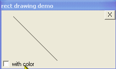



## Time to get rectal ====\>

### Description

This is a class that allows you to easily..without any api knowledge, create rect regions and fill/paint them in a variety of cool ways..and if you vote make sure you vote for Kerry
 
### More Info
 

             |
---                |---
**Submitted On**   |2005-02-01 00:57:00
**By**             |[Evan Toder](https://github.com/Planet-Source-Code/PSCIndex/blob/master/ByAuthor/evan-toder.md)
**Level**          |Intermediate
**User Rating**    |5.0 (10 globes from 2 users)
**Compatibility**  |VB 3\.0, VB 4\.0 \(16\-bit\), VB 4\.0 \(32\-bit\), VB 5\.0, VB 6\.0
**Category**       |[Custom Controls/ Forms/  Menus](https://github.com/Planet-Source-Code/PSCIndex/blob/master/ByCategory/custom-controls-forms-menus__1-4.md)
**World**          |[Visual Basic](https://github.com/Planet-Source-Code/PSCIndex/blob/master/ByWorld/visual-basic.md)
**Archive File**   |[Time\_to\_ge184625212005\.zip](https://github.com/Planet-Source-Code/evan-toder-time-to-get-rectal__1-58593/archive/master.zip)

